# Livingo Furniture Website

## Executive Summary & Project Overview

---

### Project Information

- **Project Name:** Livingo - Modern Furniture E-Commerce Website
- **Project Type:** Web&Application
- **Target Market:** Home furniture buyers and interior design enthusiasts
- **Team Size:** [6]

---

## Executive Summary

Livingo is a comprehensive e-commerce furniture website that delivers a seamless shopping experience for modern home furniture across multiple categories. The platform represents a complete digital solution for furniture retail, incorporating modern web technologies and user-centric design principles.

### Business Value Proposition

**Market Opportunity:**

- Growing online furniture market with projected 15% annual growth
- Increasing consumer preference for online furniture shopping
- Gap in market for premium, user-friendly furniture e-commerce platforms

**Competitive Advantages:**

- Complete multi-category product catalog covering all home furniture needs
- Responsive, mobile-first design optimized for modern consumers
- Comprehensive administrative tools for efficient business management
- Scalable architecture supporting future business growth

**Revenue Potential:**

- Direct product sales through integrated e-commerce functionality
- Scalable platform supporting unlimited product catalog expansion
- Foundation for additional revenue streams (premium services, partnerships)

---

## Project Scope & Objectives

### Primary Objectives

1. **Customer Experience:** Create intuitive, engaging shopping experience
2. **Business Efficiency:** Streamline furniture retail operations
3. **Market Penetration:** Establish strong online presence in furniture market
4. **Scalability:** Build foundation for future business expansion

### Functional Scope

- Complete e-commerce functionality (browse, cart, checkout, orders)
- Multi-category product management system
- User authentication and account management
- Administrative dashboard for business operations
- Responsive design for all device types

### Technical Scope

- Modern web application using HTML5, CSS3, JavaScript
- Client-side data management with LocalStorage
- Bootstrap 5 framework for responsive design
- Component-based architecture for maintainability

---

## Key Performance Indicators

### Technical KPIs

- Page load speed: Target < 3 seconds
- Mobile responsiveness: 100% compatibility
- Cross-browser support: 99%+ modern browser compatibility
- Code maintainability: Modular, documented codebase

### Business KPIs

- User engagement: Minimize bounce rate, maximize session duration
- Conversion optimization: Target 2-5% conversion rate
- Customer satisfaction: Implement feedback collection system
- Administrative efficiency: Reduce management overhead by 40%

---

## Risk Assessment Summary

### Low Risk Factors

- Proven technology stack with strong community support
- Responsive design ensuring broad device compatibility
- Modular architecture supporting easy maintenance

### Medium Risk Factors

- LocalStorage dependency requiring backup strategies
- Client-side data management requiring careful validation
- Performance optimization for large product catalogs

### Mitigation Strategies

- Comprehensive testing across multiple browsers and devices
- Data validation and backup procedures
- Performance monitoring and optimization protocols

---

## Conclusion

The Livingo furniture website represents a strategic investment in digital commerce infrastructure. With its comprehensive feature set, professional implementation, and scalable architecture, the platform positions the business for immediate market entry and long-term growth in the expanding online furniture retail sector.

# Livingo Furniture Website

## Technical Architecture & System Design

---

## System Architecture Overview

### High-Level Architecture

```
┌─────────────────────────────────────────────────────────┐
│                    CLIENT LAYER                         │
├─────────────────────────────────────────────────────────┤
│  HTML5 Semantic Structure                               │
│  CSS3 + Bootstrap 5 Responsive Styling                  │
│  Vanilla JavaScript Application Logic                   │
│  LocalStorage Data Persistence                          │
└─────────────────────────────────────────────────────────┘
              │
              ▼
┌─────────────────────────────────────────────────────────┐
│                 COMPONENT LAYER                         │
├─────────────────────────────────────────────────────────┤
│  ├── Reusable UI Components (Navbar, Footer)            │
│  ├── Page-Specific Modules                             │
│  ├── Shared Utilities (Auth, Cart Management)          │
│  └── Data Management Layer                             │
└─────────────────────────────────────────────────────────┘
```

---

## Technology Stack Analysis

### Frontend Technologies

**HTML5 (Semantic Markup)**

- Modern semantic elements for improved SEO and accessibility
- Structured document hierarchy with proper heading levels
- Form elements with built-in validation attributes
- Responsive image implementation with srcset attributes

**CSS3 (Advanced Styling)**

- CSS Custom Properties (CSS Variables) for theme management
- Flexbox and Grid layouts for complex responsive designs
- CSS Transitions and Animations for enhanced user experience
- Media queries for responsive design breakpoints

**Bootstrap 5 (UI Framework)**

- Responsive grid system with breakpoints (xs, sm, md, lg, xl, xxl)
- Pre-built components (cards, modals, carousels, forms)
- Utility classes for rapid development
- Customizable SCSS variables for brand consistency

**Vanilla JavaScript (Application Logic)**

- ES6+ features (arrow functions, destructuring, modules)
- DOM manipulation and event handling
- Asynchronous operations with Promises
- Local storage management for data persistence

---

## File Structure & Architecture

### Core Application Files

```
livingo-website/
├── index.html              # Homepage with product showcase
├── shop.html               # Product catalog with filtering
├── cart.html               # Shopping cart management
├── checkout.html           # Multi-step checkout process
├── product.html            # Individual product details
├── orders.html             # Customer order history
├── wishlist.html           # Customer wishlist
├── README.md               # Project documentation
│
├── assets/                 # Static assets
│   ├── images/
│   │   ├── products/       # Product images organized by category
│   │   ├── categories/     # Category icons and images
│   │   └── mainImg/        # Site branding and hero images
│   └── data/               # JSON data files
│  ├──  dashboard/
           ├──adminDashboard
           ├── sellerDashboard         # Product catalog styles
├── css/                    # Stylesheets
│   ├── components.css      # Shared component styles
│   ├── home.css           # Homepage specific styles
│   ├── shop.css           # Product catalog styles
│   └── checkout.css       # Checkout process styles
│
├── js/                     # JavaScript modules
│   ├── components.js       # Reusable UI components
│   ├── main.js            # Homepage functionality
│   ├── shop.js            # Product filtering and catalog
│   ├── checkout.js        # Checkout process logic
│   └── wishlist.js        # Wishlist functionality
│
└── partials/              # Reusable HTML components
    ├── navbar.html        # Navigation component
    └── footer.html        # Footer component
```

---

## Component Architecture

### Reusable Components System

**Navigation Component (navbar.html)**

- Responsive navigation with mobile hamburger menu
- Dynamic cart counter with real-time updates
- User authentication state management
- Category dropdown with organized menu structure

**Footer Component (footer.html)**

- Comprehensive site links and contact information
- Social media integration points
- Newsletter subscription form
- Responsive multi-column layout

**Product Card Component**

- Standardized product display format
- Interactive elements (add to cart, wishlist)
- Responsive image handling with lazy loading
- Consistent pricing and rating display

### Page-Specific Modules

**Homepage Module (main.js)**

- Hero carousel with automatic rotation (2-second intervals)
- Dynamic product loading from JSON data
- Category navigation with visual icons
- Best-selling products carousel with navigation controls

**Shop Module (shop.js)**

- Advanced filtering system (category, price range)
- Real-time search and filter application
- Responsive filter panels (desktop sidebar, mobile dropdown)
- Product grid with infinite scroll potential

**Cart Module (cart.html + embedded JS)**

- Real-time cart calculations and updates
- Stock validation before checkout
- Quantity controls with stock limits
- Responsive cart table design

---

## Data Management Architecture

### LocalStorage Implementation

**Data Structure Design**

````javascript
// Core Data Objects
products: [
  {
    id: "p001",
    name: "Modern Nightstand",
    price: 299,
    currency: "$",
    category: "bedroom",
    images: ["bedroom/nightstand1.jpg"],
    description: "Elegant modern nightstand...",
    stock: 15,
    rating: 4.5,
    reviews: 89
  }
]

// User Management
users: [
  {
    id: "u001",
    name: "John Doe",
    email: "john@example.com",
    cart: [],
    wishlist: [],
    orderHistory: []
  }
]

// Session Management
currentUser: {
  id: "u001",
  cart: [
    {
      id: "p001",
      quantity: 2,
      addedDate: "2024-01-15"
    }
  ]
}

 orders : [
  0: {
    id: 1756383388528,
    date: "8/28/2025, 3:16:28 PM",
    status: "Delivered",
    paymentMethod: "Cash",
    customer: {
      id: null,
      name: "Nourhan",
      company: "ejada",
      street: "Kotor Tanta Egypt",
      city: "Tanta",
      phone: null,
      email: null
    },
    items: [
      {
        id: "p033",
        name: "Modern Wooden Dining Chair",
        price: 350,
        currency: "EGP",
        quantity: 1,
        image: null
      }
    ],
  }];


### Data Persistence Strategy

**Cart Management**

- Persistent cart across browser sessions
- Real-time synchronization between user account and session
- Stock validation during cart operations
- Automatic cleanup of unavailable items

**User Session Management**

- Secure user authentication state
- Persistent login across browser sessions
- User preference storage (wishlist, order history)
- Data synchronization between localStorage objects

---

## Performance Optimization

### Loading Performance

**Resource Optimization**

- Deferred JavaScript loading with `defer` attribute
- CDN delivery for Bootstrap and external libraries
- Optimized image sizes and formats
- Minimal HTTP requests through resource consolidation

**JavaScript Performance**

- Event delegation for dynamic content
- Efficient DOM querying with modern selectors
- Debounced search and filter functions
- Memory management for large product catalogs

### Responsive Design Implementation

**Mobile-First Approach**

- Base styles designed for mobile devices
- Progressive enhancement for larger screens
- Touch-friendly interactive elements
- Optimized mobile navigation patterns

**Responsive Breakpoints**

```css
/* Bootstrap 5 Breakpoints */
xs: 0px       /* Extra small devices */
sm: 576px     /* Small devices (phones) */
md: 768px     /* Medium devices (tablets) */
lg: 992px     /* Large devices (desktops) */
xl: 1200px    /* Extra large devices */
xxl: 1400px   /* Extra extra large devices */
````

---

## Security Implementation

### Client-Side Security Measures

**Input Validation**

- Form validation using HTML5 attributes and JavaScript
- XSS prevention through proper data sanitization
- SQL injection prevention (client-side validation)
- Secure data handling for user inputs

**Session Security**

- Secure localStorage implementation
- User authentication state management
- Protected route access for authenticated users
- Session timeout handling

**Data Protection**

- Sensitive data handling protocols
- Secure payment information collection
- User privacy protection measures
- GDPR compliance considerations

---

## Browser Compatibility

### Supported Browsers

```
Desktop Browsers:
├── Chrome 90+       (Primary target)
├── Firefox 88+      (Full support)
├── Safari 14+       (Full support)
├── Edge 90+         (Full support)

Mobile Browsers:
├── iOS Safari 14+   (Optimized)
├── Android Chrome   (Full support)
├── Samsung Internet (Supported)
```

### Progressive Enhancement

- Core functionality works without JavaScript
- Enhanced features activate with JavaScript support
- Graceful degradation for older browsers
- Accessibility compliance across all browsers

---

## Development Best Practices

### Code Quality Standards

**HTML Standards**

- Semantic markup following HTML5 specifications
- Proper document structure and heading hierarchy
- Accessible form labels and ARIA attributes
- Validated markup using W3C validator

**CSS Standards**

- BEM methodology for CSS class naming
- Consistent indentation and formatting
- Modular stylesheet organization
- CSS custom properties for maintainability

**JavaScript Standards**

- ES6+ modern JavaScript features
- Consistent naming conventions and code style
- Comprehensive error handling and validation
- Modular code organization with clear separation of concerns

# Livingo Furniture Website

## Feature Specifications & User Experience (UX)

---

## Homepage Features (index.html)

### Hero Carousel Section

**Functionality:**

- 6 featured products with automatic 2-second rotation
- Manual navigation with indicator dots
- Responsive image display with glowing circle effects
- Call-to-action buttons for each featured product

**Technical Implementation:**

- Bootstrap 5 carousel component with custom styling
- Dynamic product loading from LocalStorage
- Responsive layout adapting to mobile and desktop views
- CSS animations for enhanced visual appeal

### Product Category Navigation

**Categories Implemented:**

1. **Lighting & Decor** - Lamps, mirrors, decorative items
2. **Dining Room** - Tables, chairs, dining accessories
3. **Living Room** - Sofas, TV units, coffee tables
4. **Bedroom** - Beds, nightstands, wardrobes
5. **Office** - Desks, office chairs, storage solutions
6. **Outdoor** - Patio furniture, outdoor seating

**User Experience:**

- Visual category icons for immediate recognition
- Hover effects for interactive feedback
- Direct navigation to category-specific product pages
- Responsive grid layout for all device sizes

### Product Showcase Sections

**Best Selling Products**

- Horizontal carousel with navigation arrows
- Real-time product data loading
- "View All" button for complete catalog access
- Dynamic pricing and availability display

**Explore Our Products**

- Grid layout showing diverse product range
- Limited display with "View All Products" expansion
- Product cards with essential information
- Consistent styling across all products

**New Arrivals**

- Featured product layout with large hero image
- Secondary products in smaller grid format
- Category-based product grouping
- "Shop Now" call-to-action buttons

---

## Product Catalog (shop.html)

### Advanced Filtering System

**Category Filtering**

- Collapsible category list with visual hierarchy
- Real-time filtering without page refresh
- Active category highlighting
- Mobile-responsive filter panels

**Price Range Filtering**

- Dual-range slider implementation
- Manual input fields for precise control
- Real-time price updates
- Currency-aware formatting

**Responsive Filter Design**

```
Desktop Layout:
├── Fixed sidebar with all filters visible
├── Collapsible sections for organized access
└── Persistent filter state during browsing

Mobile Layout:
├── Collapsible filter panel
├── "Filter" button trigger
└── Full-width filter sections when expanded
```

### Product Grid System

- Responsive grid adapting to screen size (1-4 columns)
- Consistent product card design
- Lazy loading potential for large catalogs
- Infinite scroll implementation ready

### Product Card Components

**Information Display:**

- High-quality product images
- Product name and category
- Price with currency formatting
- Stock availability indicator
- Quick action buttons (Add to Cart, Wishlist)

**Interactive Elements:**

- Hover effects for enhanced engagement
- Quick view product details
- Add to cart with quantity selection
- Wishlist toggle functionality

---

## Product Details Page (product.html)

### Product Information Display

**Visual Elements:**

- Large product image with zoom potential
- Multiple image gallery (when available)
- Professional product photography presentation
- Responsive image sizing for all devices

**Product Details:**

- Comprehensive product descriptions
- Pricing information with currency
- Stock availability with quantity limits
- Customer ratings and review counts
- Product specifications and features

### Interactive Purchase Controls

**Quantity Selection:**

- Increment/decrement controls
- Manual quantity input
- Stock validation to prevent over-ordering
- Real-time price calculation

**Purchase Actions:**

- "Buy Now" button for immediate cart addition
- Wishlist toggle for future consideration
- Stock availability messaging
- Out-of-stock handling with appropriate messaging

### Additional Features

**Delivery Information:**

- Free delivery availability messaging
- Return policy information display
- Delivery timeline estimates
- Customer service contact options

**Related Products:**

- "Explore More Products" section
- Similar product recommendations
- Category-based suggestions
- Seamless navigation to related items

---

## Shopping Cart (cart.html)

### Cart Management Functionality

**Product Display:**

- Comprehensive cart table with product images
- Product details (name, ID, specifications)
- Individual and total pricing calculations
- Quantity controls with real-time updates

**Cart Operations:**

```
Add Items:
├── From product pages
├── From category pages
├── From wishlist
└── Quantity validation against stock

Modify Items:
├── Increase/decrease quantities
├── Remove individual items
├── Update cart totals
└── Apply coupon codes (framework ready)

Checkout Process:
├── Cart validation before proceed
├── Stock verification
├── Total calculation with taxes/shipping
└── Redirect to secure checkout
```

### Responsive Cart Design

**Desktop Experience:**

- Full table layout with all information visible
- Easy quantity modification controls
- Clear pricing breakdown
- Prominent checkout button

**Mobile Experience:**

- Stacked card layout for better mobile viewing
- Touch-friendly quantity controls
- Simplified information display
- Optimized checkout flow

### Cart Validation Features

- Real-time stock checking during quantity updates
- Automatic removal of unavailable items
- Price recalculation on quantity changes
- Coupon code application system (ready for integration)

---

## Checkout Process (checkout.html)

### Multi-Step Checkout Design

**Billing Information Collection:**

- Complete customer information form
- Required field validation
- Address verification
- Contact information capture

**Order Summary Display:**

- Itemized product listing
- Quantity and pricing for each item
- Subtotal, shipping, and total calculations
- Order modification options before completion

### Payment Processing System

**Payment Methods Supported:**

1. **Bank Transfer**

   - Secure card information collection
   - Card number validation with formatting
   - Expiry date and CVV verification
   - Cardholder name validation

2. **Cash on Delivery**
   - Simple selection option
   - Delivery confirmation process
   - Payment upon delivery arrangement

**Payment Security:**

- Client-side form validation
- Secure data collection practices
- PCI compliance considerations
- Error handling and user feedback

### Form Validation System

```javascript
Validation Rules:
├── Required field checking
├── Email format validation
├── Phone number format verification
├── Address completeness checking
├── Payment information validation
└── Real-time error messaging
```

---

## Order Management (orders.html)

### Order Display System

**Order Information:**

- Unique order ID generation
- Complete customer details
- Delivery address information
- Order date and time stamps
- Itemized product listing with quantities

**Order Status Tracking:**

- **Pending:** Order placed, awaiting processing
- **Processing:** Order being prepared for shipment
- **Delivered:** Order completed and delivered
- **Cancelled:** Order cancelled by customer or system

### Order Management Features

**Customer Actions:**

- View detailed order history
- Cancel pending orders (with confirmation)
- Track order status updates
- Contact customer service for support

**Administrative Features:**

- Order status updates
- Order modification capabilities
- Customer communication logs
- Delivery tracking integration points

---

## Wishlist Management (wishlist.html)

### Wishlist Functionality

**Product Management:**

- Add products from any page
- Remove items from wishlist
- View saved products with full details
- Quick add to cart from wishlist

**User Experience:**

- Visual heart icon for wishlist status
- Consistent product card design
- Easy navigation between wishlist and cart
- Persistent storage across sessions

### Wishlist Features

```
User Actions:
├── Add products from product pages
├── Add products from category pages
├── Remove products from wishlist
├── Move products to cart
├── Share wishlist (future enhancement)
└── Wishlist organization (future enhancement)
```

---

## User Authentication System

### Account Management

**Registration Process:**

- Email-based account creation
- Password security requirements
- User profile information collection
- Terms of service acceptance

**Login System:**

- Secure authentication
- Session management
- Remember user preferences
- Password recovery system (framework ready)

### User Data Management

**Profile Information:**

- Personal details management
- Delivery address book
- Payment method storage (secure)
- Order history access

**Privacy Controls:**

- Data access controls
- Privacy preference settings
- Account deletion options
- GDPR compliance features

---

## Responsive Design Implementation

### Mobile-First Design Approach

**Breakpoint Strategy:**

```css
Mobile (0-576px):
├── Single column layouts
├── Touch-optimized controls
├── Simplified navigation
└── Compressed information display

Tablet (576-992px):
├── Two-column layouts
├── Expanded navigation options
├── Enhanced product displays
└── Improved interaction areas

Desktop (992px+):
├── Multi-column layouts
├── Full navigation visibility
├── Enhanced filtering options
└── Maximum information display
```

### Cross-Device Consistency

- Unified brand experience across all devices
- Consistent functionality regardless of screen size
- Optimized performance for mobile networks
- Touch and mouse interaction support

---

## User Experience Optimization

### Loading Performance

- Deferred loading of non-critical resources
- Optimized image delivery
- Minimal time to first interaction
- Progressive loading of product catalogs

### Accessibility Features

- Semantic HTML structure for screen readers
- Keyboard navigation support
- Color contrast compliance (WCAG standards)
- Alternative text for all images
- Focus management for dynamic content

### Error Handling

- Graceful error messaging
- User-friendly error recovery
- Form validation feedback
- Network error handling
- Fallback content for missing resources

# Livingo Furniture Website

## Implementation Details & Development

---

## Development Methodology

### Project Structure Implementation

**Component-Based Development Approach:**
The project follows a modular architecture where reusable components are developed independently and integrated across multiple pages. This approach ensures consistency, maintainability, and efficient development workflows.

**File Organization Strategy:**

```
Development Structure:
├── Core HTML Pages (8 main pages)
├── Shared Components (navbar, footer)
├── Modular CSS (page-specific + shared styles)
├── JavaScript Modules (feature-specific functionality)
└── Asset Management (organized by category and type)
```

### Code Quality Implementation

**HTML5 Semantic Structure:**

- Proper document outline with hierarchical heading structure
- Semantic elements (nav, main, section, article, aside)
- Accessibility-first markup with ARIA attributes
- Form elements with built-in validation attributes

**CSS Architecture:**

- CSS Custom Properties for theme consistency
- BEM methodology for class naming conventions
- Modular stylesheets with clear separation of concerns
- Responsive design using mobile-first approach

**JavaScript Implementation:**

- ES6+ modern JavaScript features and syntax
- Modular code organization with clear function separation
- Event-driven architecture for user interactions
- Comprehensive error handling and validation

---

## Data Architecture Implementation

### LocalStorage Data Management

**Data Structure Design:**

```javascript
// Product Data Schema
const productSchema = {
  id: "string", // Format: p001, p002, etc.
  name: "string", // Product display name
  price: "number", // Numeric price value
  currency: "string", // Currency symbol ($, €, etc.)
  category: "string", // Category identifier
  images: ["string"], // Array of image paths
  description: "string", // Product description
  stock: "number", // Available quantity
  rating: "number", // Rating (1-5 scale)
  reviews: "number", // Number of customer reviews
};

// User Data Schema
const userSchema = {
  id: "string", // Format: u001, u002, etc.
  name: "string", // User full name
  email: "string", // User email address
  phone: "string", // Contact phone number
  address: "object", // Structured address data
  cart: ["object"], // Array of cart items
  wishlist: ["string"], // Array of product IDs
  orderHistory: ["string"], // Array of order IDs
};
```

**Data Persistence Strategy:**

- Automatic data synchronization between user session and localStorage
- Real-time cart updates with immediate persistence
- User preference storage across browser sessions
- Data integrity validation on every operation

### Cart Management Implementation

**Real-Time Cart Operations:**

```javascript
// Cart functionality implementation
function addToCart(productId, quantity = 1) {
  // Stock validation
  const product = getProductById(productId);
  if (product.stock < quantity) {
    showStockError(product.stock);
    return false;
  }

  // Add/update cart item
  const currentUser = getCurrentUser();
  const existingItem = currentUser.cart.find((item) => item.id === productId);

  if (existingItem) {
    existingItem.quantity += quantity;
  } else {
    currentUser.cart.push({
      id: productId,
      quantity: quantity,
      addedDate: new Date().toISOString(),
    });
  }

  // Persist changes
  updateUserData(currentUser);
  updateCartUI();
  return true;
}
```

**Stock Management:**

- Real-time stock validation during cart operations
- Automatic stock checking before checkout
- Stock level updates reflected immediately
- Out-of-stock product handling with user notifications

---

## User Interface Implementation

### Responsive Design System

**Bootstrap 5 Integration:**

- Custom theme variables for brand consistency
- Responsive grid system implementation
- Component customization for unique design requirements
- Utility class usage for rapid development

**Custom CSS Implementation:**

```css
/* Theme Variables */
:root {
  --main-color: #a0804d;
  --secondary-color: #cf9a61;
  --text-primary: #333;
  --text-secondary: #666;
  --background-primary: #fff;
  --border-color: #ddd;
}

/* Responsive Breakpoints */
@media (max-width: 576px) {
  /* Mobile-specific styles */
}

@media (min-width: 577px) and (max-width: 768px) {
  /* Tablet-specific styles */
}

@media (min-width: 769px) {
  /* Desktop-specific styles */
}
```

### Interactive Element Implementation

**Product Carousel System:**

- Bootstrap 5 carousel component with custom controls
- Automatic rotation with user override capability
- Touch/swipe support for mobile devices
- Indicator navigation with visual feedback

**Filter System Implementation:**

```javascript
// Advanced filtering functionality
function applyFilters() {
  const categoryFilter = getSelectedCategories();
  const priceRange = getPriceRange();
  const searchTerm = getSearchTerm();

  const filteredProducts = products.filter((product) => {
    const categoryMatch =
      categoryFilter.length === 0 || categoryFilter.includes(product.category);
    const priceMatch =
      product.price >= priceRange.min && product.price <= priceRange.max;
    const searchMatch = product.name
      .toLowerCase()
      .includes(searchTerm.toLowerCase());

    return categoryMatch && priceMatch && searchMatch;
  });

  renderProductGrid(filteredProducts);
}
```

---

## E-Commerce Functionality Implementation

### Shopping Cart System

**Cart State Management:**

- Real-time cart item synchronization
- Persistent cart across browser sessions
- Multi-user cart isolation and security
- Automatic cart cleanup for unavailable items

**Checkout Process Implementation:**

```javascript
// Checkout validation and processing
function processCheckout() {
  // Validate cart contents
  const cartValidation = validateCart();
  if (!cartValidation.isValid) {
    showValidationErrors(cartValidation.errors);
    return false;
  }

  // Validate billing information
  const billingValidation = validateBillingInfo();
  if (!billingValidation.isValid) {
    showBillingErrors(billingValidation.errors);
    return false;
  }

  // Process order
  const order = createOrder();
  const orderResult = submitOrder(order);

  if (orderResult.success) {
    clearCart();
    redirectToConfirmation(orderResult.orderId);
  } else {
    showOrderError(orderResult.error);
  }
}
```

### Order Management System

**Order Processing Workflow:**

1. Order creation with unique ID generation
2. Customer information validation and storage
3. Product availability final verification
4. Order status initialization (Pending)
5. Inventory update and stock reduction
6. Order confirmation and user notification

**Order Status Management:**

```javascript
const orderStatuses = {
  PENDING: "Pending",
  PROCESSING: "Processing",
  SHIPPED: "Shipped",
  DELIVERED: "Delivered",
  CANCELLED: "Cancelled",
};

function updateOrderStatus(orderId, newStatus) {
  const orders = getOrders();
  const orderIndex = orders.findIndex((order) => order.id === orderId);

  if (orderIndex !== -1) {
    orders[orderIndex].status = newStatus;
    orders[orderIndex].lastUpdated = new Date().toISOString();
    saveOrders(orders);
    notifyStatusChange(orderId, newStatus);
  }
}
```

---

## Performance Optimization Implementation

### Loading Performance

**Resource Loading Strategy:**

- Critical CSS inline for above-the-fold content
- Non-critical JavaScript loaded with defer attribute
- Image lazy loading for improved initial page load
- CDN utilization for third-party libraries

**JavaScript Performance Optimization:**

```javascript
// Debounced search for performance
function createDebouncedSearch() {
  let timeoutId;
  return function (searchTerm) {
    clearTimeout(timeoutId);
    timeoutId = setTimeout(() => {
      performSearch(searchTerm);
    }, 300);
  };
}

const debouncedSearch = createDebouncedSearch();
```

### Memory Management

**Efficient DOM Manipulation:**

- Event delegation for dynamic content
- Minimal DOM queries with result caching
- Clean event listener management
- Efficient array operations for large datasets

**LocalStorage Optimization:**

- Selective data loading based on user needs
- Data compression for large objects
- Regular cleanup of expired session data
- Efficient serialization/deserialization


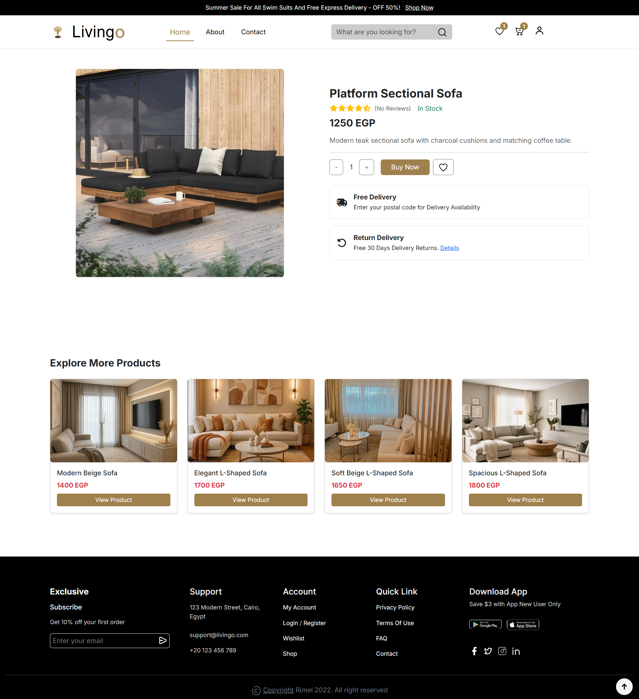

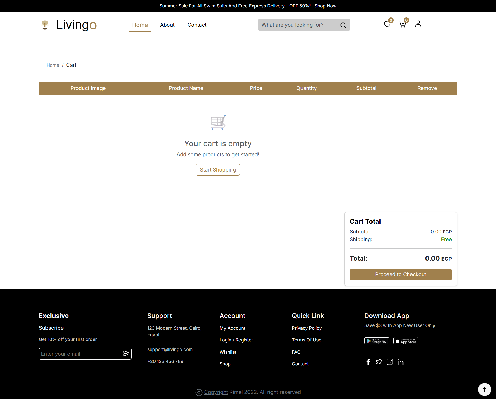

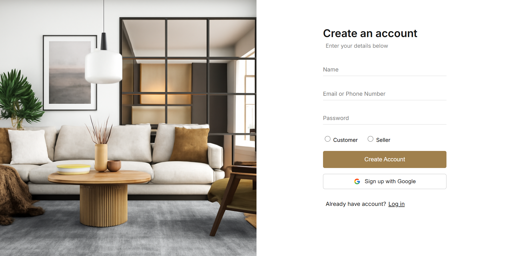
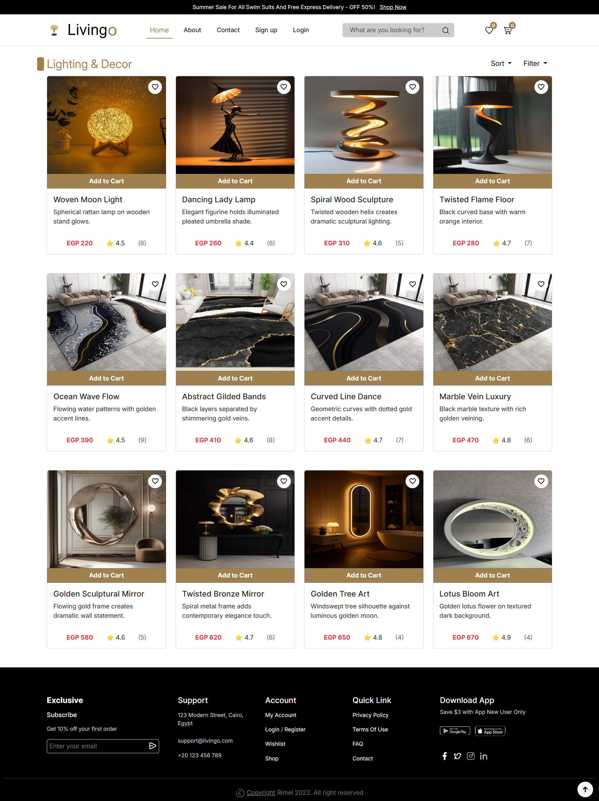

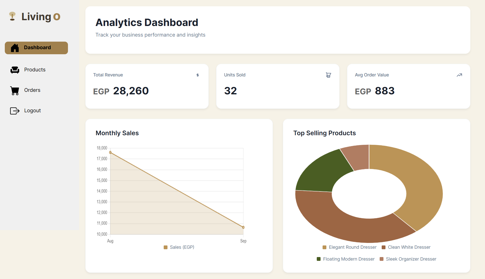
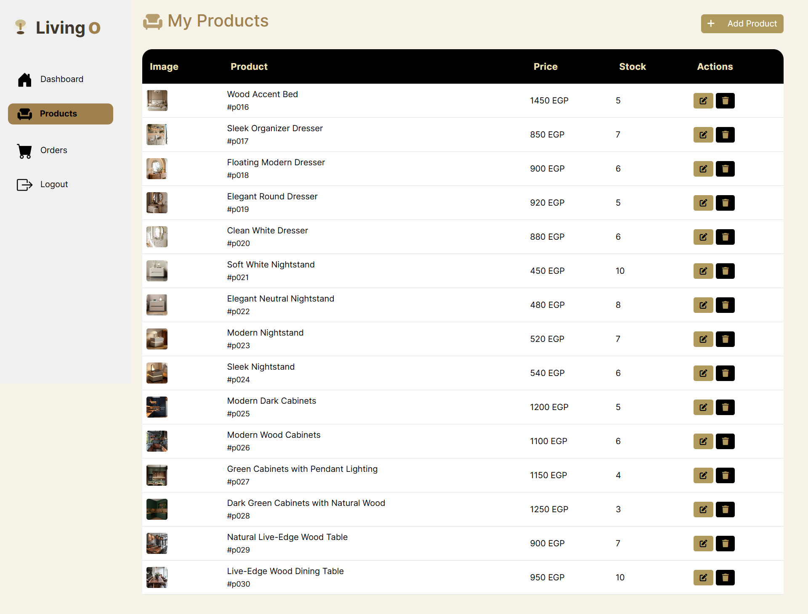
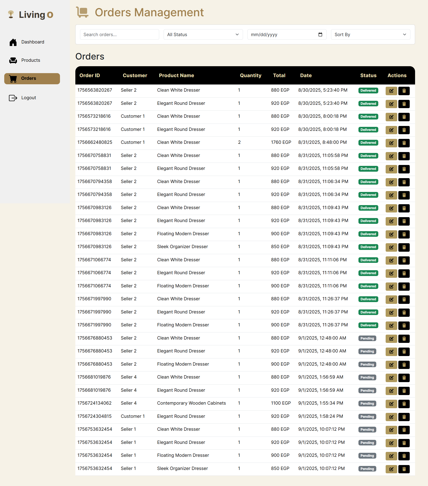
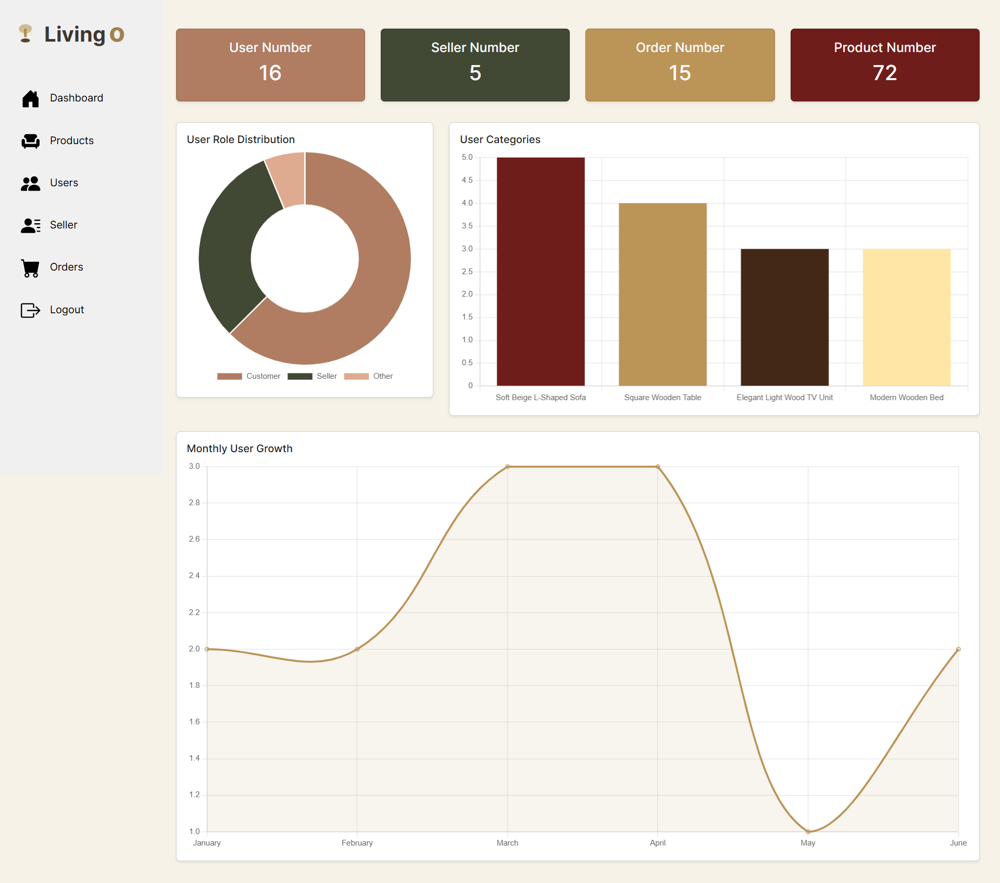
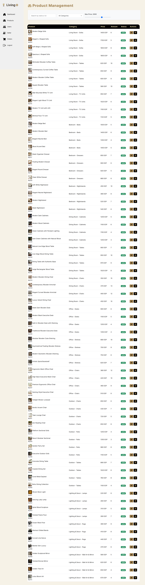
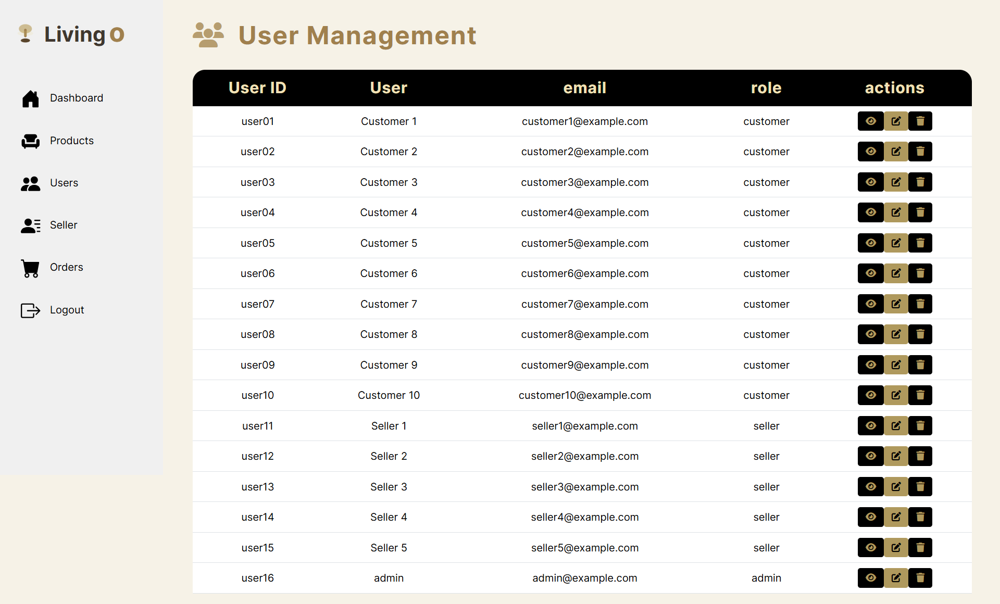
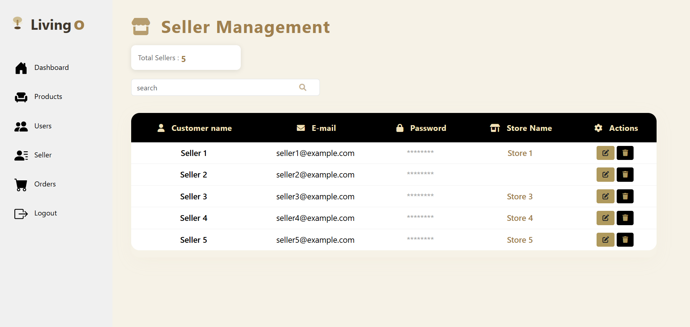
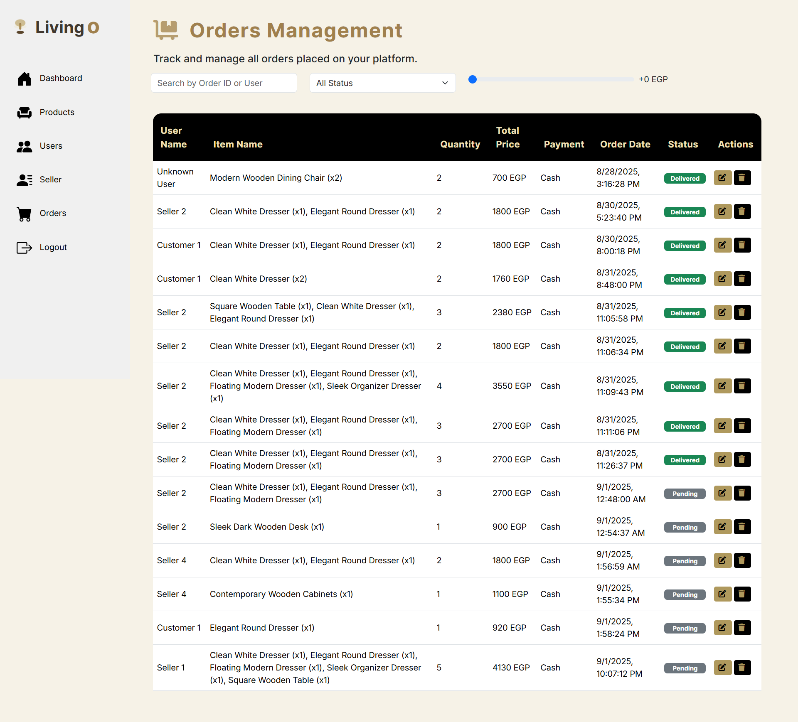
